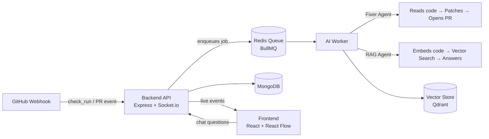

<div align="center">

# 🧠 Git-Mind

### An AI-Driven, Self-Healing CI/CD Visualizer

*When your build breaks, Git-Mind doesn't just alert you — it fixes it, opens the PR, and shows you the whole thing happening live on a node graph.*


</div>

---

## 🎯 What is Git-Mind?

Git-Mind is an **autonomous, event-driven developer tool** — not a chatbot wrapper. It plugs into a GitHub repository via webhooks, and when a build or check run fails, it:

1. **Detects** the failure the moment GitHub reports it
2. **Diagnoses** the error using an AI agent that reads the actual broken code
3. **Fixes** it by writing a patch and opening a real pull request
4. **Visualizes** the entire process live, node by node, on an interactive graph — so you *watch* the fix happen instead of digging through logs

It ships with a **Human-in-the-Loop safety architecture**: the AI is capped at 3 retries before it stops and hands control back to a developer, so it never runs away unsupervised.

On top of that, it includes **"Ask Git-Mind"** — a RAG-powered chat that lets developers ask natural-language questions about their own codebase and get citation-backed answers, powered by Tree-Sitter-based semantic chunking and vector search.

---

## ✨ Core Capabilities

| Capability | What it does |
|---|---|
| 🔍 **Live Webhook Ingestion** | Listens for GitHub `pull_request` / `check_run` events in real time |
| 🩹 **Self-Healing Fix Engine** | AI agent reads broken files, generates a patch, commits, and opens a PR automatically |
| 🧩 **Node-Graph Visualization** | React Flow canvas renders commits, PRs, and AI actions as live, animated nodes |
| 💬 **Codebase Q&A (RAG)** | Chat with your own repo — ask "why is this failing" and get a grounded, cited answer |
| 🛡️ **Human-in-the-Loop Guardrails** | Max 3 automated retries, then escalates to a human — no runaway agents |
| 📡 **Real-Time Sync** | Socket.io pushes every state change straight to the UI as it happens |

---

## 🏗️ Architecture



The system is split into four decoupled layers — **Frontend**, **Backend API**, **AI Worker**, and a **Shared package** — so the "traffic-directing" server never blocks on slow AI calls, and the heavy lifting happens asynchronously in the background.

---

## 🛠️ Tech Stack

<div align="center">

| Layer | Technologies |
|---|---|
| **Frontend** | React · Vite · Tailwind CSS · Zustand · React Flow · Socket.io Client |
| **Backend** | Node.js · Express · MongoDB (Mongoose) · Redis · Socket.io |
| **AI Worker** | LangChain · OpenAI API · BullMQ · Octokit · Tree-Sitter |
| **Infra** | Docker Compose · Qdrant (Vector DB) · GitHub Webhooks |

</div>

---

## 📁 Monorepo Structure

```
git-mind/
├── frontend/src/
│   ├── store/            → Zustand global state
│   ├── hooks/             → useWebSocket (live Socket.io connection)
│   ├── services/          → Axios + Socket.io clients
│   ├── components/        → Reusable UI primitives (Button, Modal, Card...)
│   └── features/
│       ├── canvas/        → React Flow graph, commit/AI nodes, custom edges
│       ├── chat-rag/       → "Ask Git-Mind" chat drawer + citations
│       ├── pr-metrics/     → Live build metrics & error log viewer
│       └── sidebar/        → Navigation
│
├── backend/src/
│   ├── webhooks/           → GitHub receiver + event router
│   ├── controllers/        → REST endpoints (repos, chat)
│   ├── services/           → DB, Queue, GitHub service logic
│   ├── sockets/            → Real-time event emission
│   └── models/             → Repository, PullRequest, AILog schemas
│
├── ai-worker/src/
│   ├── queue/worker.js     → BullMQ consumer (fix-code, rag-query jobs)
│   ├── agents/
│   │   ├── fixerAgent.js   → Self-healing patch generation
│   │   └── ragAgent.js     → Citation-grounded codebase Q&A
│   ├── tools/               → GitHub ops + Tree-Sitter code parsing
│   ├── vector-store/        → Embedding + similarity search
│   └── prompts/              → System instructions for each agent
│
├── shared/src/              → Cross-package constants & utils
├── docker-compose.yml        → One-command local infra (Mongo, Redis, Qdrant)
└── package.json               → Monorepo workspace root
```

---

## 🚀 Getting Started

```bash
# 1. Spin up local infrastructure (MongoDB, Redis, Qdrant)
docker compose up -d

# 2. Install all workspace dependencies
npm install

# 3. Run each service in its own terminal
npm run dev -w frontend    # → http://localhost:5173
npm run dev -w backend     # → API + Socket.io server
npm run dev -w ai-worker   # → background job consumer
```

---

## 🔐 Safety by Design

Git-Mind is built as an **autonomous agent with boundaries**, not a black box:

- ✅ AI-generated fixes always go through a **real pull request** — nothing merges automatically
- ✅ Capped at **3 retries** before escalating to a human
- ✅ Every AI action is **logged and visualized live** — full transparency, not a silent background process

---

<div align="center">

*Built as a 4-person team project — RAG Engine module by Shreyas.*

</div>
